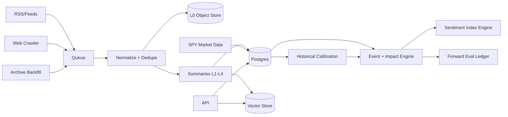

# 02_ARCHITECTURE.md
## Topology

## Services
- api (FastAPI)
- worker (queue consumers)
- daemon (continuous loop + caps)
- postgres, redis
- object store (/data/artifacts)
- vector store (pgvector default)

## Pipelines
- Live: discover→fetch→dedupe→summarize→embed→event/impact→index
- Historical: backfill→same pipeline→align to SPY→initial calibration priors
